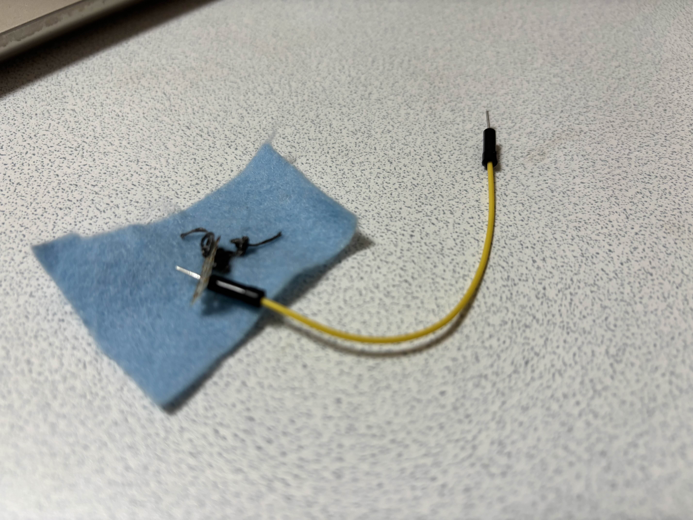
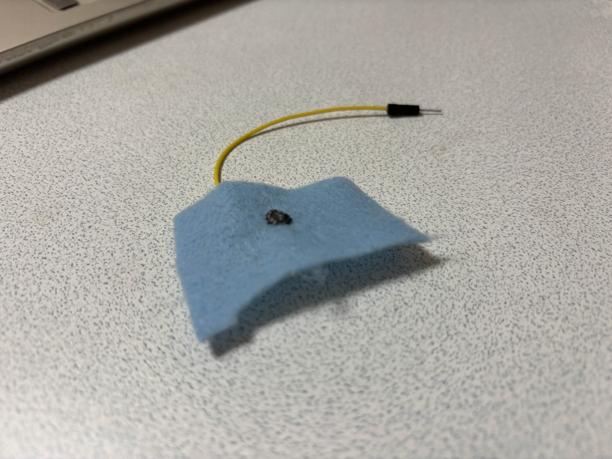

## 概要
ぬいぐるみに電導糸を縫い付けてタッチセンサとして利用できるかを試してみました。
狙いとしては、縫い付けた電導糸自体がセンサとして機能し、触れたことを検知できるようにすることです。

電導糸のセンシングは調べたところ2種類ありそうでした。

電導糸の抵抗を使った方法
静電容量を使った方法
今回は後者の静電容量を使った方法でやりました。
(おそらく後者の方が一般的)

## 環境
**ソフトウェア**
* 開発環境: PlatformIO
* フレームワーク: Arduino
* 使用したデバイス: Atom S3

**ハードウェア**

表側：電導糸を縫い付けた部分


裏側：裏面の縫い付けパターン

## プログラムの解説
ESP32S3では静電容量タッチセンサーを扱うための関数が用意されており、簡単に扱うことができます。静電容量測定回路がデバイス内にあり、指定したタッチ対応GPIOに接続された電極の静電容量を測定しています。
```
int v = touchRead(TOUCH_PIN);
```


readTouchAveraged()ではノイズの抑制のために複数個データをとり平均を出しています。
```
int readTouchAveraged() {
   int v = touchRead(TOUCH_PIN); // ESP32-S3は「触れると数値が上がる」傾向
   smaSum -= smaBuf[smaIdx];
   smaBuf[smaIdx] = v;
   smaSum += v;
   smaIdx = (smaIdx + 1) % SMA_N;
   return smaSum / SMA_N;
}
```

### 結果

> **ある程度なら反応する**

私の環境だと手を電導糸周辺にのせたときに正しく反応しました。
しかし、AtomS3から電導糸まで伸びている配線の方が感度がよく、そちらは触れなくても近づけるだけで反応してしまい誤作動を起こしてしまう感じでした。おそらく電導糸の縫い方によっても大きく変わってくると思うので要検討です。
今後、電導糸やノイズ低減を見直し動作改善を行います。

### 環境
* 開発環境: PlatformIO
* フレームワーク: Arduino
* 使用したデバイス: Atom S3
